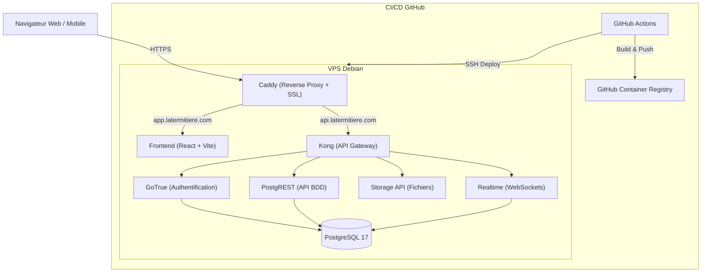

# Architecture Globale — La Termitière

**Version :** 1.0  
**Statut :** Production  
**Cible :** Développeurs / DevOps / Architectes  
**Dernière mise à jour :** Juillet 2026  

---

# 1. Vue d'ensemble de l'Infrastructure

La Termitière repose sur une architecture moderne, découplée et orientée "Self-Hosted". 
Le système est divisé en deux grands pôles :
1. **Le Frontend (Stateless)** : Une application React/Vite distribuée et packagée via Docker.
2. **Le Backend (Stateful)** : Une instance Supabase complète (PostgreSQL, Auth, Storage, Edge Functions) hébergée sur un VPS Debian.



---

# 2. Composants Détaillés

## 2.1 Le Frontend (React + Vite)
- **Stack :** React, Vite, Tailwind CSS.
- **Hébergement :** Conteneur Docker éphémère.
- **Serveur HTTP :** **Caddy** est utilisé pour servir les fichiers statiques `/dist` et gérer la terminaison SSL (Let's Encrypt).
- **Communication :** Le Frontend ne communique **jamais** directement avec la base de données. Il passe par l'API REST générée automatiquement par Supabase (PostgREST) en utilisant la clé publique anonyme (`anon key`).

## 2.2 Le Backend (Supabase Self-Hosted)
L'ensemble des briques Supabase tourne dans un réseau Docker dédié (`supabase_default`).
- **PostgreSQL 17 :** Le cœur du système. Contient les schémas métier (`public`), l'authentification (`auth`) et le stockage (`storage`).
- **PostgREST :** Transforme instantanément la base de données PostgreSQL en une API RESTful sécurisée.
- **GoTrue (Auth) :** Gère la création de comptes, la génération des tokens JWT et la vérification des e-mails. Connecté directement au RLS de Postgres.
- **Kong :** La porte d'entrée (Gateway) qui filtre toutes les requêtes entrantes, vérifie les clés d'API (anon/service_role) et route vers le bon micro-service (Auth, Rest, Storage).

## 2.3 Sécurité et Accès (RLS)
La sécurité de l'application est garantie par la base de données elle-même via **Row Level Security (RLS)**.
L'accès public (`anon`) est totalement bloqué pour les tables métier (ex: `tp_agro_demandes`, `tp_foncier_dossiers`). Seules les requêtes disposant d'un token JWT valide (généré par GoTrue lors du login) peuvent traverser le pare-feu PostgreSQL.

---

# 3. Flux de Déploiement Continu (CI/CD) et Stratégie Git

Le projet suit un workflow Git strict pour sécuriser la production :
- **`dev`** : Branche d'intégration où les développeurs collaborent au quotidien.
- **`vps-deploy`** : Branche de déploiement continu. Tout push/merge sur cette branche déclenche automatiquement l'envoi vers le VPS.
- **`main`** : Branche "Source de Vérité" (Pristine). Personne ne pousse dessus. Elle est mise à jour uniquement par le Lead Dev à la fin d'un chantier, accompagnée de **Tags** (ex: `v1.2.0`) pour marquer les versions stables.

1. **GitHub Actions (`ghcr-test.yml`)** compile l'image du Frontend (déclenché par `vps-deploy`).
2. L'image est stockée de façon privée sur **GHCR**.
3. Via une connexion SSH sécurisée par clé asymétrique (Ed25519), GitHub Actions ordonne au VPS de télécharger la nouvelle image et de relancer le conteneur `termitiere-web`.

---

# 4. Arborescence du Projet

- `/deploy/` : Contient le `Dockerfile` Multi-Stage et le `Caddyfile`.
- `/migration/supabase/` : Scripts de gestion de la BDD (migrations SQL, script d'authentification `auth-migrate.mjs`).
- `/src/` : Le code source React modulaire (Agro, Logistique, Foncier, Garderie, Projet...).
- `/.github/workflows/` : Les pipelines automatisés.

---

# 5. Zoom sur le Frontend (Build & Serveur Web)

Le Frontend (React) est packagé via un processus de build multi-étapes (Multi-Stage Build) avec Docker pour garantir une image finale extrêmement légère et sécurisée.

## 5.1 Étape 1 : Build (Node.js)

```dockerfile
# ---------- Étape 1 : Build (Node.js) ----------
FROM node:20-alpine AS build
```
Dans cette étape, on installe les dépendances (`npm ci`) et on compile l'application Vite/React en fichiers statiques.

Le Frontend a besoin de connaître l'URL et la clé anonyme de Supabase au moment de la compilation. Le `Dockerfile` intercepte les variables et crée dynamiquement le `.env.production.local` :
```dockerfile
# Injection dynamique via printf
RUN printf "VITE_USE_SUPABASE=%s\nVITE_SUPABASE_URL=%s\nVITE_SUPABASE_ANON_KEY=%s\n" \
      "$VITE_USE_SUPABASE" "$VITE_SUPABASE_URL" "$VITE_SUPABASE_ANON_KEY" > .env.production.local \
    && npm run build
```
*(Ces variables `$VITE_...` sont transmises au `Dockerfile` depuis l'extérieur via des arguments de build, par exemple depuis le pipeline GitHub Actions ou le fichier `docker-compose.yml`)*.

## 5.2 Étape 2 : Le Serveur Web (Caddy)

```dockerfile
# ---------- Étape 2 : Serveur Web (Caddy) ----------
FROM caddy:2-alpine
COPY --from=build /app/dist /srv/app
COPY deploy/Caddyfile /etc/caddy/Caddyfile
```
La deuxième étape abandonne complètement Node.js et récupère uniquement les fichiers statiques compilés.

**Pourquoi Caddy ?**
Contrairement à Nginx, Caddy gère nativement le protocole HTTPS. Il assure :
- Le service des fichiers statiques React.
- Le renouvellement automatique des certificats SSL/TLS via Let's Encrypt.
- Le routage intelligent (SPA) : redirection des requêtes 404 vers `index.html`.
- Le **Reverse Proxy vers l'API Supabase** : Caddy intercepte le domaine d'API (`api.latermitiere.com`) et le redirige vers le port interne de Kong (`host.docker.internal:8000`).
